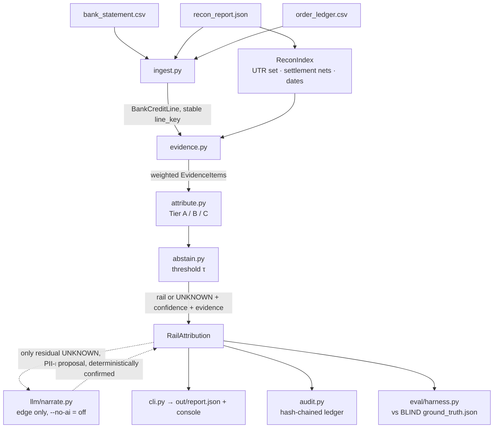

# untangle — Architecture

Status: **attribution + reconciliation + fee-GST + exceptions + eval + web UI** (User Stories 1–3)
are built, measured, and independently audited, with a server-rendered landing page and an
interactive results dashboard. This document describes what exists in code today.

## The one-paragraph mental model

A merchant's bank statement is a pile of credits from many sources. `untangle` looks at
each credit and decides **which payment rail it came from** — Razorpay, another gateway,
direct UPI, a COD payout, or something unrelated — using deterministic evidence tied back
to Razorpay's settlement report. When the evidence is weak, it says **UNKNOWN** instead of
guessing, because a wrong "this is Razorpay's" corrupts every downstream number. A language
model is allowed to help read *messy narration text* — nothing else, and never to make a
money verdict alone.

## Data flow

**Isolation:** `engine/` never imports `generator/` and never reads `ground_truth.json`.
`eval/` is the *only* reader of ground truth. A static test (`tests/unit/test_isolation.py`)
enforces both — this is what makes the reported numbers trustworthy.

## The modules (what each one does and why it exists)

| Module | Job | Why it's separate |
|---|---|---|
| `engine/bank_adapters.py` | Detect schema and parse bank exports via fail-closed adapters | Isolate bank format variations behind a deterministic, fail-closed schema boundary |
| `engine/ingest.py` | Load + validate the 3 files; derive a **stable line_key** = hash(value_date, amount, narration, bank_ref) | Real statements have no stable row id; we must never use the generator's `line_id` (that would be cheating) |
| `engine/evidence.py` | Turn a credit into **weighted signals** (UTR match, narration keyword, amount correlation, date proximity, Razorpay identity) | Signals are facts; keeping them separate from the verdict makes both testable |
| `engine/attribute.py` | Combine signals into a **rail verdict or UNKNOWN** via Tiers A→B→C | The decision logic lives in one auditable place |
| `engine/abstain.py` | The **threshold τ** below which a line abstains; the cost model behind it | Abstention is a first-class outcome, not a failure |
| `engine/llm/mask.py` | Strip PII before any text leaves the process | Constitution: PII never reaches a model |
| `engine/llm/client.py` | Provider-agnostic LLM call; `--no-ai` = no-op | No vendor lock-in; the whole pipeline runs without AI |
| `engine/llm/narrate.py` | The **only** place a model touches attribution — reads messy narration, proposes a rail, deterministic rules confirm | Constitution: AI at the edge, never the money verdict alone |
| `engine/audit.py` | Hash-chained ledger of decisions | Tamper-evidence for a money-adjacent system |
| `engine/cli.py` | The `run` command → report + console | The product's interface |
| `eval/metrics.py` + `eval/harness.py` | Score vs blind ground truth: per-rail + per-hard-case P/R, decoy FP, conservation | The only component allowed to see the answer key |
| `eval/benchmark.py` | Complete-pipeline 15 MiB stress & resource benchmark | See [BENCHMARK.md](BENCHMARK.md) |

## Bank statement adapter boundary

Bank statement parsing is governed by a fail-closed adapter architecture (`engine/bank_adapters.py`)
that normalizes recognized statements into canonical `BankCreditLine` records:

- **Deterministic Schema Detection**: Schema detection is strictly structural and deterministic based on
  normalized header names (handling case variations, UTF-8 BOM, and surrounding whitespace). It never
  uses fuzzy matching, bank keywords, or transaction narration to detect format schemas.
- **Fail-Closed Decision Contract**:
  1. *Exactly one adapter matches*: input is parsed by the matching adapter.
  2. *Zero adapters match*: fails closed with an actionable `InputError`.
  3. *Multiple adapters match*: fails closed with an actionable ambiguity `InputError` (never guesses or picks first).
- **Registration Order Independence**: Detection and resolution behavior is invariant to adapter registration order.
- **Production Scope**: Currently, only the existing generic CSV adapter (`GenericCsvBankAdapter`, version 1.0.0)
  is registered. Bank-specific adapters will be introduced separately with evidence-backed fixtures.
  See [BANK_FORMAT_EVIDENCE.md](BANK_FORMAT_EVIDENCE.md) for the current support matrix and evidence tiers.

## Web concurrency and admission boundary

Untangle's web layer (`webapp/app.py`) isolates synchronous reconciliation execution from the async ASGI event loop under a strict, fail-closed concurrency contract:

- **Early Admission Control**: Capacity is guarded by a process-local bounded semaphore (`_RECONCILE_SEMAPHORE` with `_RECONCILE_SLOTS = 2`). Excess requests are turned away immediately with HTTP 503 *before* creating per-request temporary directories or saving uploaded files to disk.
- **Worker Slot Ownership**: Concurrency slots are managed through `_ReconciliationSlot`. When a request is admitted, the worker thread retains exclusive ownership of its slot until execution truly terminates (including on timeouts and async task cancellations). This guarantees that no more than 2 worker threads can execute simultaneously at any point in time.
- **Immediate Resource Cleanup**: Temporary directories and uploaded file streams are cleaned up and deleted immediately upon request completion, client rejection (413/422/503), timeout (504), or internal error (500).
- **Immutable Byte Snapshots**: Worker threads read and own immutable in-memory byte snapshots (`reconcile_bytes`), ensuring concurrent requests operate in total isolation without cross-contamination.

## The three attribution tiers (the heart of it)

Evidence is combined with **noisy-OR** (independent signals reinforce; one strong signal
dominates; capped at 0.99).

- **Tier A — decisive tie.** A UTR token in the narration that *exactly equals* a
  `settlement_utr` from Razorpay's report → `razorpay_settlement`. Near-zero false-positive
  risk: decoys carry no real settlement UTR.
- **Tier B — weighted combination.** No exact UTR, so score the weak signals: per-rail
  narration keywords (PayU/Delhivery/@ybl/…), amount-equals-a-settlement-net, value-date
  proximity, Razorpay brand/IFSC identity. Highest-scoring rail wins **if** it clears τ.
- **Tier C — bounded set-sum.** For a Razorpay-looking credit whose amount isn't a single
  settlement net, try summing 2–3 settlement nets within the date window (merge /
  carry-forward). Bounded (≤3 terms, ≤40 candidates) — abstain rather than explode.

**Two guards that protect precision (both added after the audit):**
1. *Coincidental-amount guard:* a Razorpay verdict needs a **substantive** signal (UTR,
   set-sum, or identity token) — an amount+date coincidence **alone** abstains.
2. *Decoy veto / precision guard:* the Razorpay brand word is deliberately weak and is
   voided by decoy markers; Razorpay may only outrank a distinctive competing keyword when
   it has a hard recon tie.

## Why the numbers look the way they do

- **Precision 1.000, recall ~0.84–0.91:** by design the engine only commits when it has a
  real tie back to the settlement report — a UTR match, a bounded set-sum, a unique
  settlement-net amount, or a provably-unique split reconstruction — and abstains otherwise.
  So it is almost never *wrong* (precision), while still recovering split-settlement legs when
  their amounts uniquely sum to a settlement net. The residual tail is the honest exception queue.
- **Zero decoy false-positives across 5 seeds:** the exact adversarial cases a naive brand
  grep fails (100% FP in the difficulty probe) — the tiered evidence + decoy veto handle.

## Security posture (threat model, short form)

- **Read-only toward money:** no module has any write/payout capability. The system cannot
  move funds even if wrong or compromised.
- **PII never reaches a model:** masked in `llm/mask.py` before any call.
- **Secrets only from gitignored `.env`.** Nothing sensitive in the repo.
- **Prompt-retaining models** (e.g. a free stealth model) are fine for synthetic + masked
  data, but real merchant data must never be sent to one — deterministic path or a
  non-retaining provider only.
